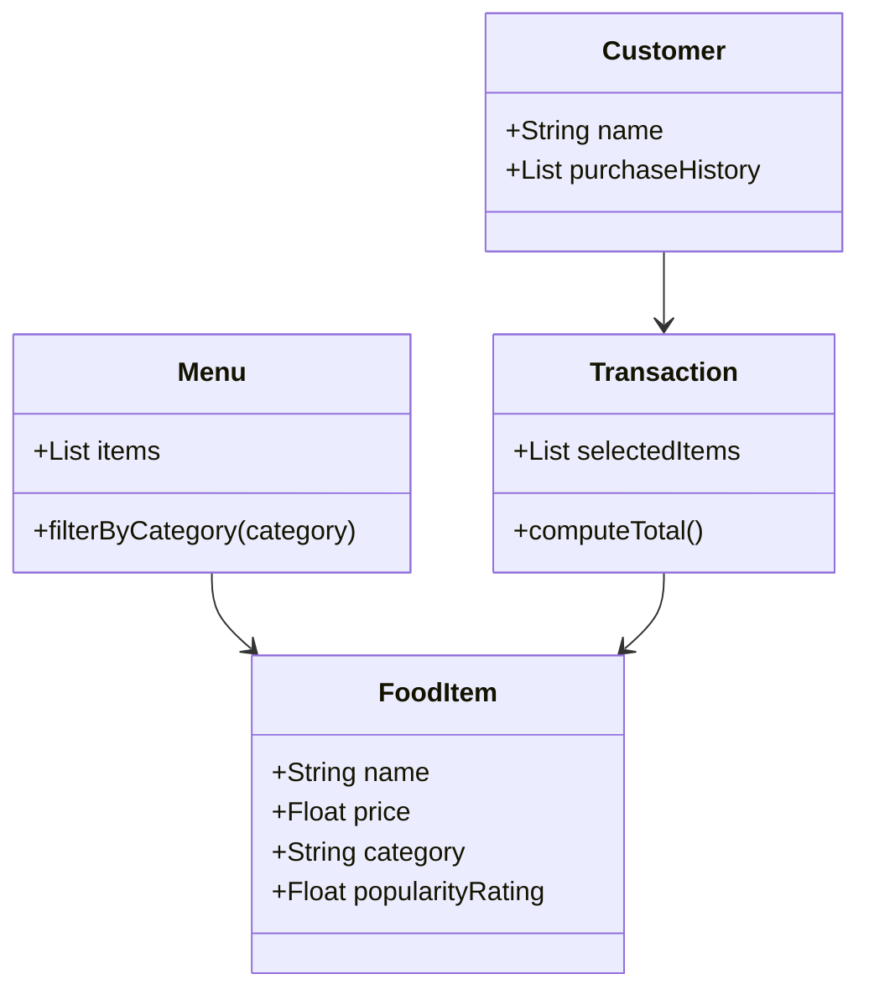

```mermaid
classDiagram
    class Customer {
        +String name
        +List purchaseHistory
    }

    class FoodItem {
        +String name
        +Float price
        +String category
        +Float popularityRating
    }

    class Menu {
        +List items
        +filterByCategory(category)
    }

    class Transaction {
        +List selectedItems
        +computeTotal()
    }

    Customer --> Transaction
    Menu --> FoodItem
    Transaction --> FoodItem
```
